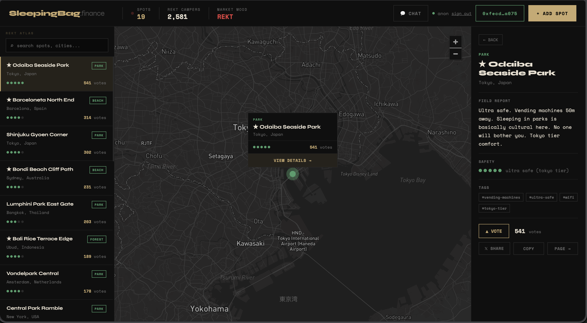

# 🛌 SleepingBag.finance

> *Your portfolio hit zero. We built the next step.*

**[sleepingbag.finance](https://sleepingbag.finance)**

---



---

## ser, the market is down.

Your leveraged longs are liquidated. Your landlord wants rent. Your bags are empty.

We made a map.

SleepingBag.finance is a community atlas of outdoor sleeping spots for rekt crypto degens — beaches, parks, rooftops, bridges — rated by safety, tagged by people who actually slept there, sorted by survival count.

**Two types of users. Same desperation.**

The actually rekt — needs a real floor tonight.
The degen with a wallet — camping for the content.

Both welcome. Judging no one.

---

## How it works

- Find a spot on the map
- Read the field report from fellow degens
- Check the safety rating (1 = extremely rekt → 5 = tokyo tier)
- Vote if you survived
- Add your own spot when you find one

No sign up. No KYC. Just coordinates and vibes.

---

## Safety scale

```
●○○○○  1 — extremely rekt     police everywhere. ngmi.
●●○○○  2 — risky ser          proceed with caution
●●●○○  3 — degen approved     community tested
●●●●○  4 — comfy homeless     solid spot. good vibes.
●●●●●  5 — ultra safe         tokyo tier. vending machines 50m.
```

---

## Roadmap

- [x] Interactive map with 15+ spots worldwide
- [x] Field reports, safety ratings, community voting
- [x] Global chat — no auth, just talk
- [x] Mobile layout
- [ ] Real database — spots survive refresh
- [ ] Wallet connect — your spots, your profile
- [ ] Zora integration — every spot mints a coin. hold the coin = you were there.
- [ ] Smart contracts on Base — bet on spots, own them as NFTs
- [ ] ???
- [ ] WAGMI

---

## The thesis

The bear market creates two kinds of people.

Those who learn from it.
And those who find a good spot under a bridge and add it to the map.

We built this for both.

---

*NGMI. But at least you'll have a place to sleep.*

*Built by [@NovaAppolo](https://twitter.com/NovaAppolo) and Claude (CTO).*
